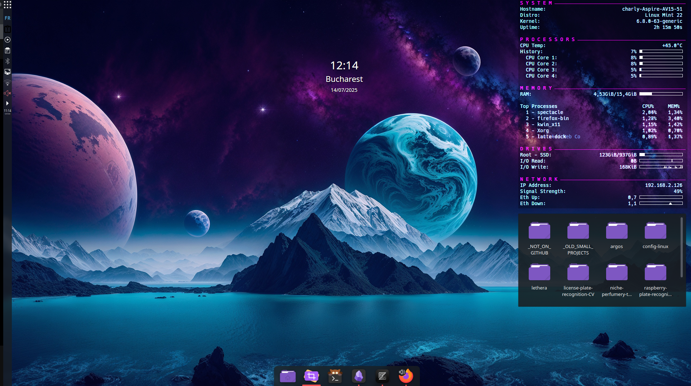
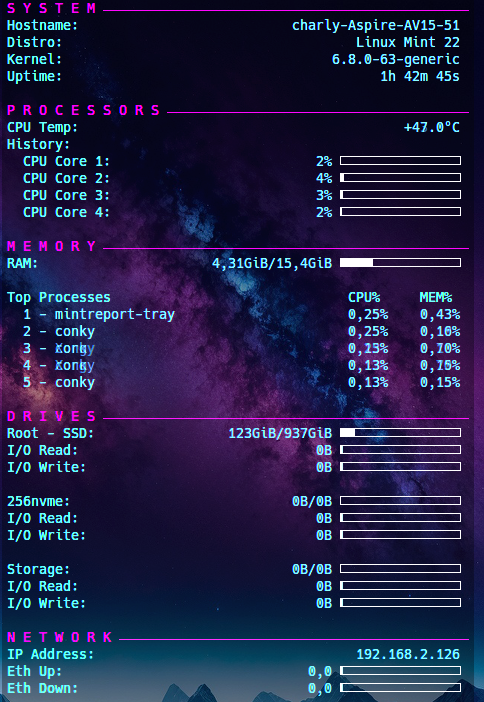
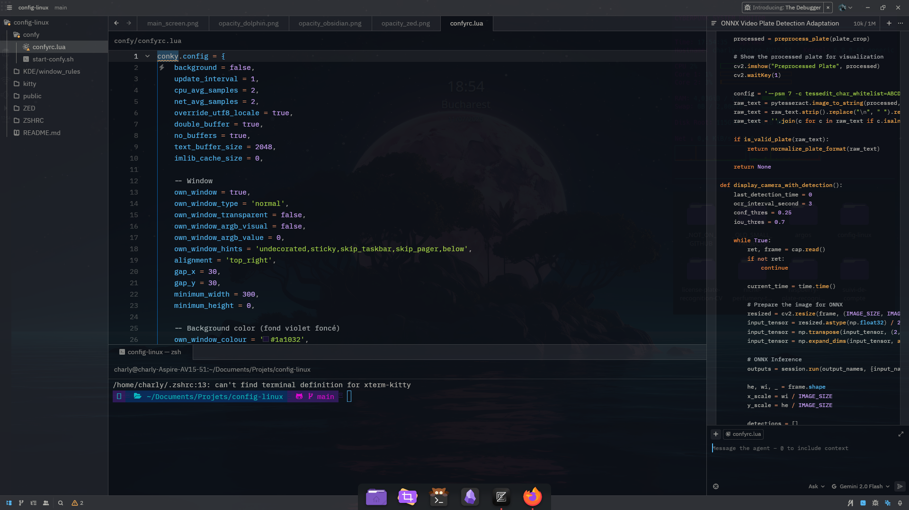
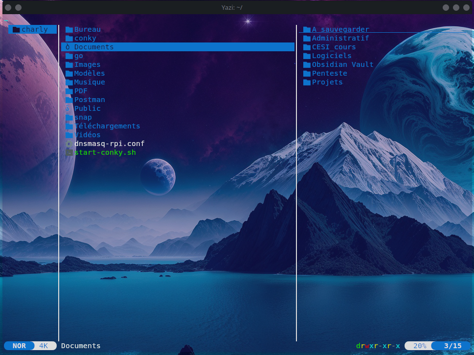

# linux-mint-kde-config

My personal Linux Mint setup with KDE Plasma and various tools.

## KDE Plasma Configuration

### Theme

- **Application Style:** Breeze
- **Plasma Style / Window Decorations:** Sweet-Mars
- **Color Scheme:** Breeze Dark
- **Icons:** Tela Purple Dark
- **Desktop Effects Enabled:**
  - Glitch
  - Sliding Popups
  - Tooltip Fade
  - Screen Edge
  - Background Contrast
  - Desaturate Unresponsive Applications
  - Tooltip Fade Animation
  - Blur
  - Geometry Change
  - Maximize Animation
  - Fullscreen
  - Login / Logout
  - Translucency

### Widgets

The widget to track CPU, cores, RAM, root disk and network was created via conky and is not native to KDE.

---

## Zed Editor Configuration

- **AI:** `Gemini-2.0-flash`
- **AI extensions:** Super Maven

### Zed theme

Place theme.json into .config/zed/themes folder

Set "theme": "Rosé Pine" in .config/zed/settings.json

> Note: More customization details to be added if configuration files are exported.

---

## My terminal

### Terminal Tools

These are the terminal tools I use regularly, chosen for their performance, usability, and modern features:

- **zsh**
  A powerful and extensible shell that replaces Bash. Offers advanced autocompletion, globbing, and theming (commonly used with Oh My Zsh or Prezto).

- **fzf**
  A general-purpose fuzzy finder. Great for quickly searching files, history, Git branches, etc. Can be integrated with many shell commands and workflows.

- **batcat** (aka `bat`)
  A cat clone with syntax highlighting, Git integration, and line numbers. Useful for reading code or config files directly from the terminal with style.

- **yazi**
  A fast and minimal terminal file manager written in Rust. It supports image previews, smooth navigation, and Vi keybindings.

- **tldr**
  Simplified and community-maintained man pages. Instead of reading long manuals, `tldr` gives you practical examples for common commands.

- **mpv**
  A versatile media player for audio and video. Often used in the terminal with simple commands, supports many formats and configurations.

- **cava**
  Console-based Audio Visualizer for ALSA or PulseAudio. Displays real-time audio spectrum bars in the terminal. Often used with `mpv` or music players.

- **lsd**
  A modern replacement for `ls`, written in Rust. Provides colorful output, icons, and more readable formatting for directory listings.

- **zoxide**
  A smarter `cd` command that learns your directory habits. Quickly jump to frequently or recently visited folders using just parts of their names.

---

## Resources

Here are two YouTube videos that helped me customize my KDE Plasma setup:

- [Make your KDE Sweet | Customizing KDE Plasma](https://www.youtube.com/watch?v=PyyxQYkloLo)
  A detailed walkthrough of applying the Sweet theme and customizing Plasma's look.

- [Make KDE Plasma Desktop Look Aesthetic](https://www.youtube.com/watch?v=AFqPCgRQmGc)
  Aesthetic tweaks, theming tips, and layout inspiration for a clean and modern KDE desktop.

- [Zed theme Rose Piné](https://github.com/huahuadeliaoliao/rose-pine-zed-transparent/tree/main)

---

This repository is intended to save and share my current Linux Mint and KDE Plasma setup, including tweaks, themes, and tools I use daily. The configuration files are located in the various folders.
