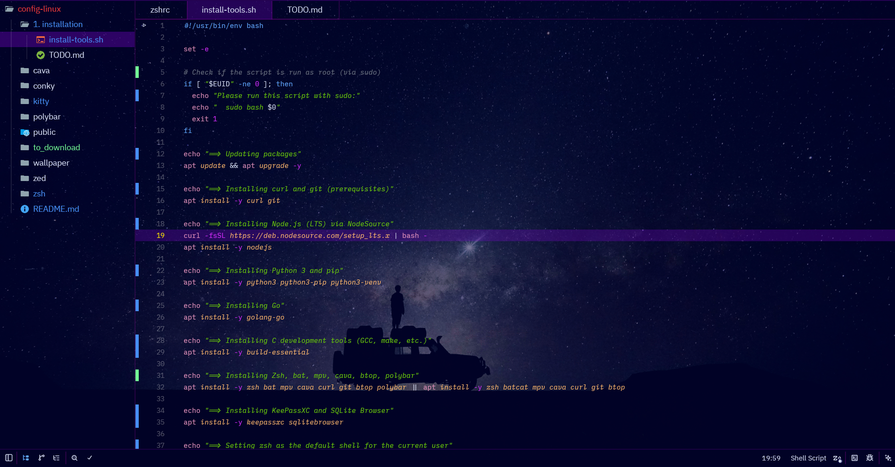

# linux-mint-xfce-config

This is my Linux Mint XFCE setup with Polybar — an ultra-lightweight configuration that uses around 1.05 GB of RAM when idle, which is impressively low. I also included some custom Conky widgets I coded myself in one of the folders, although I’m currently not using them.

---

## Zed Editor Configuration

For development, I use the Zed IDE — a fast and powerful code editor written in Rust. It’s designed for performance and responsiveness, making it perfect for both lightweight coding and large projects. Zed also supports integration with AI tools, allowing you to add your own API keys for an enhanced development experience.

---

## Terminal Tools

These are the terminal tools I use regularly, chosen for their performance, usability, and modern features : I run the Kitty terminal with Oh My Zsh and the Powerlevel10k theme, which provide a fast, customizable, and visually appealing shell experience.

- **zsh**
- **LazyDocker**
- **batcat**
- **mpv**
- **cava**
- **btop**
- **yazi**
- **zoxide**

---

This repository is intended to save and share my current Linux Mint and KDE Plasma setup, including tweaks, themes, and tools I use daily. The configuration files are located in the various folders.
