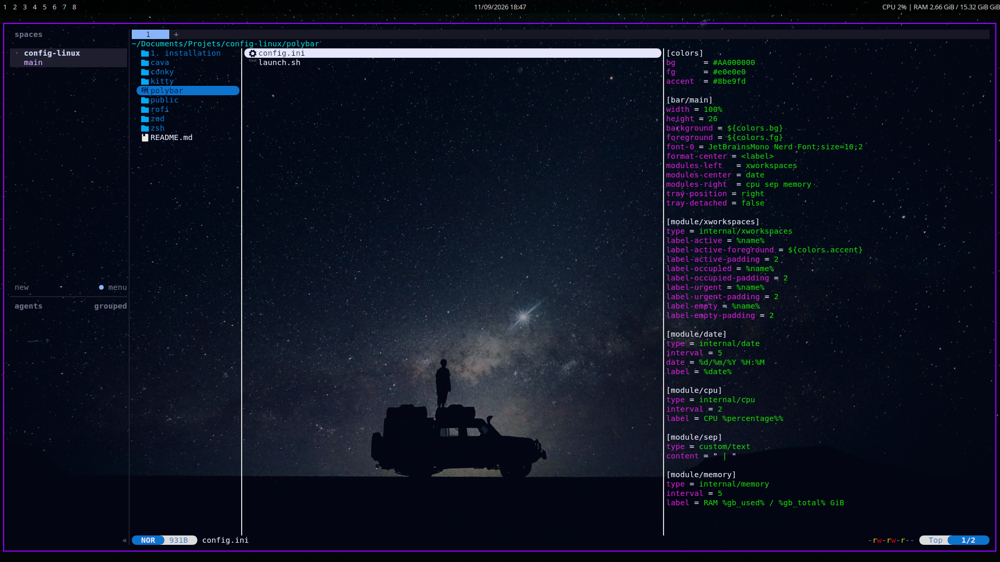

# linux-mint-xfce-config

My lightweight **Linux Mint XFCE** setup with **Polybar** and **Rofi**, focused on performance, simplicity, and a clean workflow.

The system uses around **1.05 GB of RAM at idle**, keeping the desktop fast and lightweight.

## Kitty as IDE

For coding, I use **Kitty** as my main terminal environment, combined with **Codex** and **Herdr** for development and AI-assisted workflows.

I use **Yazi** for fast and efficient terminal-based file navigation.

## Terminal Tools

My daily terminal setup includes:

- zsh
- lazygit
- eza
- zoxide
- yazi
- btop

This repository contains my current **Linux Mint XFCE configuration**, including themes, tweaks, Polybar configuration, and the tools I use daily.
